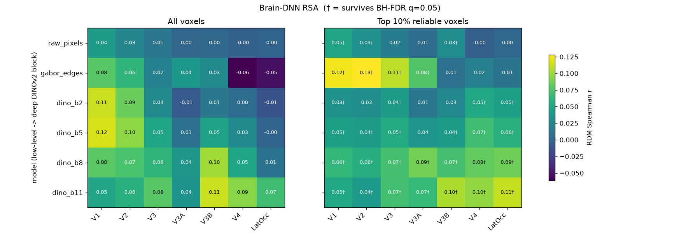
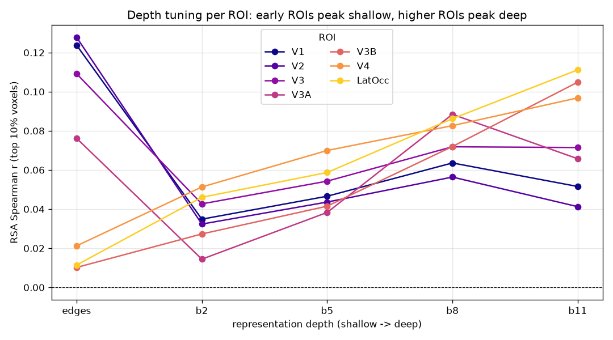
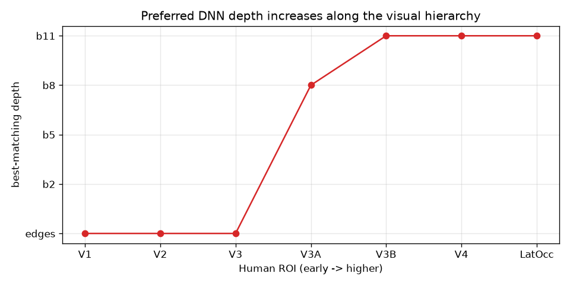
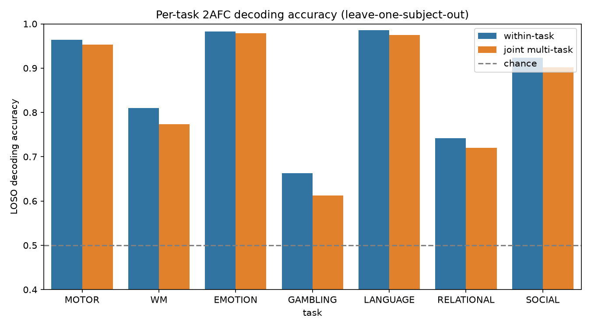
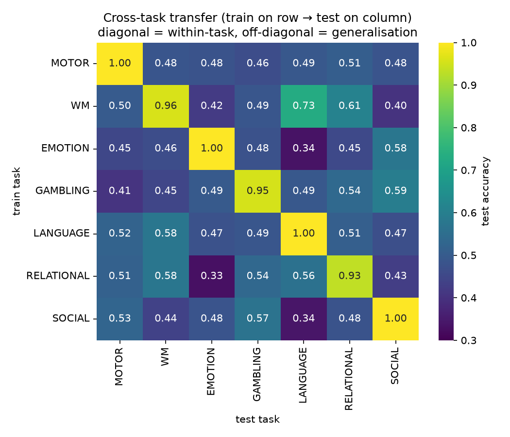
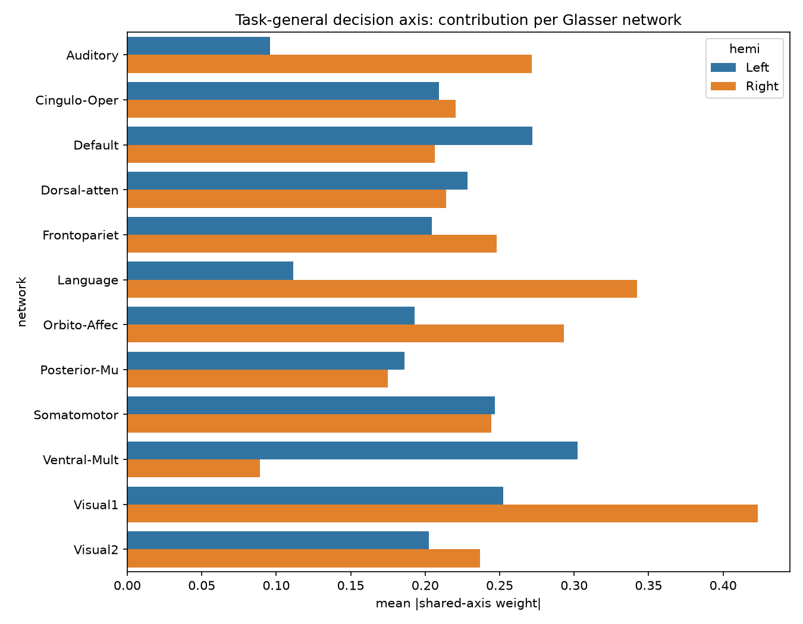
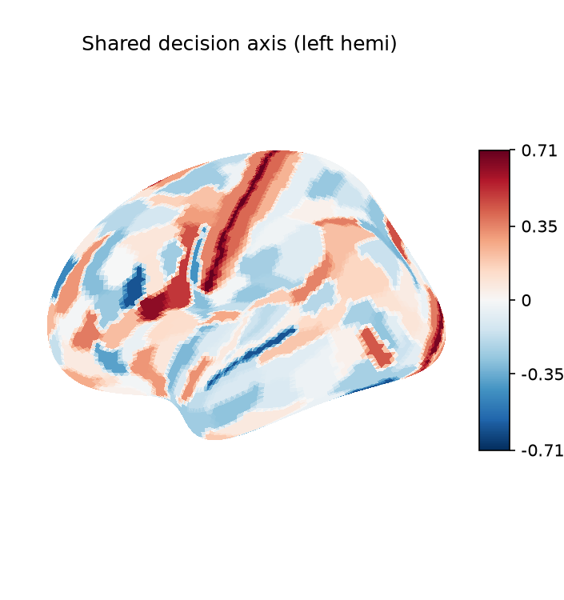
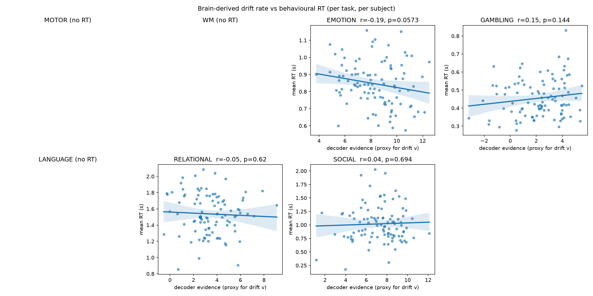
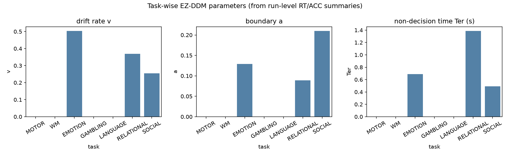

# Mathematical Modelling of the Human Brain from fMRI

A two-part computational-neuroscience study that walks the visual hierarchy up
from a self-supervised vision transformer's features into single-subject brain
representations, then crosses the whole cortex to decode what a person is doing, 
and infer stable cognitive traits from task-fMRI alone.

> **Note:** In order to use the HCP dataset, please electronically sign the HCP
> data use terms at [ConnectomeDB](https://db.humanconnectome.org). Instructions
> are on pp. 24–25 of the
> [HCP Reference Manual](https://www.humanconnectome.org/storage/app/media/documentation/s1200/HCP_S1200_Release_Reference_Manual.pdf).


## Overview

The project is organised as two complementary studies on different fMRI
datasets:

| Part | Dataset | Subjects | Question |
|------|---------|----------|----------|
| **1** | Kay *et al.* natural-image fMRI (`kay_images.npz`) | 1 (visual cortex) | Do **early** DNN features match **early** visual ROIs (V1/V2) and **deep** semantic features match **higher** ROIs (V4/LatOcc)? |
| **2** | HCP task-fMRI (`hcp_task`) | 100 (whole cortex, 360 Glasser parcels) | Can one decode **what task / decision** a brain is performing across 7 tasks, and read out stable per-subject **cognitive traits**? |


## Repository Layout

```
├── pyproject.toml                 # project + dependencies (uv-managed)
├── uv.lock                        # locked dependency graph
├── .python-version                # 3.13
│
├── part_1/                        # Brain–DNN RSA
│   ├── download_data.py           # fetch Kay natural-image fMRI from OSF
│   ├── dino_brain_rsa.ipynb       # MAIN: DINOv2 vs ROI RSA pipeline
│   └── figs/                      # rsa_*.png output figures
│
└── part_2/                        # Cross-task decoding & traits
    ├── download_data.py           # fetch + extract HCP task-fMRI
    ├── helpers.py                 # data loading, 2AFC label maps, trial windows
    ├── predict_trial.py           # CLI: decode a single HCP trial
    ├── ddm.ipynb                  # MAIN: decoders + EZ-DDM + 3D brain
    ├── subject_traits.ipynb       # MAIN: theory-driven trait profiles
    └── figs/                      # fig1–5 PNGs + interactive .html
```

## Part 1: Brain vs. DNN: Representational Similarity (RSA)

**Notebook:** [`part_1/dino_brain_rsa.ipynb`](part_1/dino_brain_rsa.ipynb)

We compare three families of model representations against each human visual ROI
using **Representational Similarity Analysis** on the 120 held-out test images:

- **`raw_pixels`**: a trivial low-level baseline.
- **`gabor_edges`**: a canonical V1-like edge-energy model (multi-scale,
  multi-orientation Gabor filter bank) that anchors the low-level end.
- **`dino_block_k`**: patch features from **DINOv2 (ViT-S/14)** blocks at
  increasing depth (early blocks = local/texture, late blocks = semantic).

### Method

1. **Feature extraction**: preprocess grayscale stimuli to ImageNet-normalised
   224×224 RGB and extract per-block ViT features from DINOv2.
2. **RDMs**: build a Representational Dissimilarity Matrix (`1 - cosine`) for
   each model representation and for each ROI's voxel responses.
3. **RSA**: correlate model and ROI RDMs with **Spearman** correlation.
4. **Reliability boost**: recompute ROI RDMs using only the **top 10%** most
   responsive (highest-variance) voxels per ROI to raise the noise ceiling.
5. **Significance**: a **2000-shuffle permutation test** per (model, ROI) cell,
   followed by **Benjamini–Hochberg FDR** correction across all 42 cells.

> With only 120 noisy test images, RDM correlations of ~0.05–0.2 are the expected
> ceiling. The informative signal is the **gradient** across blocks and ROIs.

### Results

**RSA heatmap**: every model/block × every ROI (all voxels vs. top-10% reliable, FDR-marked)

<p></p>

**Depth gradient**: RSA as a function of DINOv2 block depth, per ROI

<p></p>

**Peak depth per ROI**: the block depth at which each ROI's RSA peaks (the hierarchy fingerprint)

<p></p>


## Part 2: Cross-Task Cortical Decoding & Cognitive Traits

Part 2 works on **HCP task-fMRI from 100 subjects**, parcellated into the
**360-region Glasser atlas**, across **7 tasks** (MOTOR, WM, EMOTION, GAMBLING,
LANGUAGE, RELATIONAL, SOCIAL). Every task is reframed as a **two-alternative
forced choice (2AFC)** (e.g. MOTOR -> left vs. right, WM -> 0-back vs. 2-back,
EMOTION -> neutral vs. fear). See [`part_2/helpers.py`](part_2/helpers.py) for the
trial-windowing (HRF-shifted, fixed 8 s window to remove the duration confound)
and the full label mapping.

### 2A: Decoders + Drift-Diffusion Read-out

**Notebook:** [`part_2/ddm.ipynb`](part_2/ddm.ipynb)

A per-trial brain state is the mean BOLD over the trial's HRF-shifted frames per
parcel, z-scored within subject. Three decoders are trained:

1. **Within-task** ridge logistic regression with **leave-one-subject-out** CV.
2. **Cross-task transfer**: train on task A, test on task B -> a 7×7 matrix
   revealing which decision axes generalise across tasks.
3. **Joint multi-task** model: a shared linear trunk plus per-task heads.

Decoder **log-odds** are then interpreted as the **drift rate `v`** of a
drift-diffusion model, and the bound `a` and non-decision time `Ter` are
estimated per task with **EZ-DDM** (Wagenmakers, van der Maas & Grasman 2007)
from run-level accuracy and RT summaries parsed out of `Stats.txt`.

**Per-task accuracy**: within-task vs. joint multi-task decoding

<p></p>

**Cross-task transfer**: 7×7 train-task × test-task accuracy heatmap

<p></p>

**Shared decision axis (networks)**: shared-axis weight by network/hemisphere

<p></p>

**Shared axis (surface)**: shared-axis weights mapped to the cortical surface

<p></p>

**Drift vs. RT**: decoder log-odds (drift proxy) vs. reaction time, per task

<p></p>

**EZ-DDM parameters**: `v`, `a`, `Ter` estimates per task

<p></p>

The per-class and shared decision axes are also rendered as **interactive 3D
brains** (open standalone in a browser):
[`class_axis_3d.html`](part_2/figs/class_axis_3d.html) and
[`shared_axis_3d.html`](part_2/figs/shared_axis_3d.html).

> **Note:** GitHub's Markdown renderer strips embedded JavaScript, so Plotly
> `.html` figures cannot render inline in this README (they open standalone in a
> browser).

CLI helper for inspecting individual predictions:

```bash
# Predict subject 100307's first 'rh' MOTOR trial (run LR), holding them out of training
python part_2/predict_trial.py --task MOTOR --subject 100307 --run 0 --cond rh --trial 0

# Cross-task transfer: train on WM, predict LANGUAGE trials
python part_2/predict_trial.py --task LANGUAGE --train-task WM --subject 100307 --run 0
```

### 2B: Theory-Driven Cognitive Traits

**Notebook:** [`part_2/subject_traits.ipynb`](part_2/subject_traits.ipynb)

Each subject is reduced to a **7-dimensional trait vector**, where every trait is
a theory-driven linear combination of brain-activation contrasts (within specific
Glasser networks) and behaviour:

| Trait | Definition |
|-------|------------|
| **fearfulness** | Fear > Neutral activation in orbito-affective + face areas (FFC) |
| **reward_sensitivity** | Win > Loss activation in orbitofrontal cortex |
| **loss_chasing** | Strong loss reaction with poor win/loss differentiation |
| **working_memory** | Multiple-demand recruitment under load (2bk > 0bk) + performance |
| **cognitive_control** | Accuracy × RT cautiousness trade-off (RELATIONAL) |
| **social_cognition** | Mentalising > Random contrast in TPJ/STS/temporal-pole hubs |
| **language_engagement** | Left-lateralised language-network recruitment (math > story) |

Scores are z-scored across the cohort and rendered as **interactive radar +
heatmap + scatter dashboards** per subject, saved to
`figs/subject_<id>_traits.html` (e.g.
[`subject_100307_traits.html`](part_2/figs/subject_100307_traits.html)) (these
open standalone in a browser).


## Getting Started

This project uses [`uv`](https://github.com/astral-sh/uv) with Python 3.13.

```bash
# 1. Install dependencies into a local virtual environment
uv sync

# 2. Download the datasets (each into its own part's data/ directory)
cd part_1 && uv run python download_data.py && cd ..
cd part_2 && uv run python download_data.py && cd ..
```

## Reproducing the Results

| Goal | Run |
|------|-----|
| Part 1 RSA figures | open & run `part_1/dino_brain_rsa.ipynb` |
| Part 2 decoders, DDM, 3D brain | open & run `part_2/ddm.ipynb` |
| Part 2 cognitive-trait dashboards | open & run `part_2/subject_traits.ipynb` |
| Single-trial decoding (CLI) | `python part_2/predict_trial.py --help` |

All figures are written to the respective `figs/` directories.

---

## Authors

19M081MMS *Mathematical Modeling and Simulations*,
Palace of Science, Center for Applied Mathematics.

- [Mihailo Radović](https://github.com/mradovic38)
- [Boško Zlatanović](https://github.com/bole6)
- [Filip Marčić](https://github.com/fmr538)